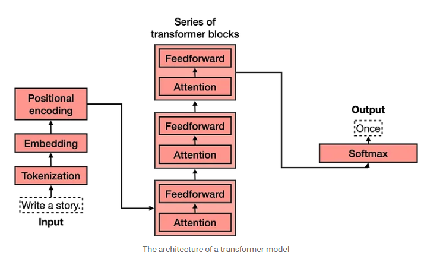

# CV Backbone
- MLP -> CNN -> Transformer
- MLP의 한계점: 이미지를 flatten해서 이미지의 locality 파악 어려움 -> convolution filter 사용하여 해결 -> CNN의 한계점: 시각 정보간 관계/중요도 파악 어려움 -> NLP에서 제안된 Transformer를 CV에 적용하여 해결 -> data-centric AI 
## 1. CNN
### 1.1 Convolution Filter (Filter/Kernel)
- 정의: 이미지 처리를 위해 사용되는 행렬로, Kernel 또는 Mask
- 연산: 같은 필터를 이미지 전체에 슬라이딩 윈도우(Sliding Window) 방식으로 이동시키며 합성곱 연산 수행 
- 목적: 과거에는 Edge detection, Blurring 등을 위해 고정된 필터를 사용했으나, CNN은 데이터로부터 최적의 필터 값을 스스로 학습 목적
- 결과물: 연산 결과를 Feature Map 또는 Activation Map
### 1.2 주요 파라미터 및 기법
- Channel: 흑백(Grayscale) 이미지는 1개, 일반 컬러 이미지는 3개(RGB)의 채널을 가짐. 필터 적용 시 입력 데이터의 채널 수를 고려해야
- Stride: 슬라이딩 윈도우의 이동 보폭(Step)을 조절하여 출력 피처 맵의 크기를 조절
- Padding: 이미지 주변에 0과 같은 빈칸을 추가하여 피처 맵의 크기가 급격히 작아지는 것을 방지하고 외곽 정보를 보존
- Pooling: 파라미터 학습 없이 피처 맵의 크기를 축소
- MaxPooling: 영역 내 가장 큰 값을 선택
- AveragePooling: 영역 내 평균값을 선택

## 2. CNN Backbone 모델
### 2.1 AlexNet
- 혁신: CNN을 사용한 최초의 모델이자 GPU 연산을 고려한 딥러닝 모델
- ReLU: $Max(0, x)$ 형태의 활성화 함수를 사용하여 비선형 패턴을 효율적으로 학습
- Dropout: 학습 시 무작위로 뉴런을 비활성화하여 특정 뉴런에 대한 의존도를 낮추고 과적합(Overfitting)을 방지
### 2.2 VGG
- 특징: 모든 레이어에 3x3 Convolution Filter만 고집하여 단순하면서도 깊은 네트워크를 구성
- 이점: 작은 필터를 여러 개 쌓으면 큰 필터(예: 5x5) 하나를 쓰는 것과 동일한 수용 영역(Receptive Field)을 가지면서도, 파라미터 수를 줄이고 비선형 연산을 늘려 학습 성능을 높일 수 있음
### 2.3 ResNet (Residual Network)
- 핵심 개념: Identity Shortcut (Skip Connection)*도입.
- 해결 문제: 네트워크가 깊어질수록 기울기가 사라지는 Gradient Vanishing 문제를 해결하여 100층 이상의 매우 깊은 모델 학습을 가능하게 함
- 구조: 입력 $x$를 출력에 더해주는 $F(x) + x$ 방식을 사용하여 잔차(Residual)를 학습
### 2.4 EfficientNet
- 핵심 개념: 모델의 효율성과 정확도 사이의 최적 균형을 찾는 Compound Scaling 기법 제안
- Scaling 요소: 세 가지 차원을 동시에 고려하여 모델을 확장
1. Depth: 네트워크의 깊이 (레이어 수).
2. Width: 네트워크의 너비 (채널 수).
3. Resolution: 입력 이미지의 해상도.
- 결과: 적은 파라미터와 연산량으로도 기존 모델 대비 더 높은 정확도를 달성

## 3. Transformer 

### 3.1.

- 출처: https://medium.com/@lordmoma/the-transformer-model-revolutionizing-natural-language-processing-a16be54ddb1e
- Long-range Dependency 해결: 멀리 떨어진 데이터(단어 또는 이미지 패치) 간의 상관관계를 효과적으로 학습
- 높은 연산 효율성과 확장성. 데이터셋과 모델 크기가 계속 커져도 모델 성능이 포화되지 않고 지속적으로 증가
- 범용성: 자연어 처리(NLP), 컴퓨터 비전(ViT) 등 다양한 분야의 백본(Backbone)으로 활용. Large Language Model 발전의 발판이 됨

### 3.2. 파이프라인: input text -> tokenized text -> embeddings+positional info
- Tokenization: 문장을 의미 있는 최소 단위인 토큰(단어, 구두점 등)으로 분할하고 사전에 정의된 번호를 할당
- Word Embedding: 토큰을 컴퓨터가 계산 가능한 수치 벡터 형태(Embedding)로 변환
- Positional Encoding/Embedding: 단어의 위치 정보를 벡터에 추가. 최근에는 학습 가능한 파라미터인 'Positional Embedding'을 주로 사용

### 3.3. Self-Attention 메커니즘: Input embedding이 query, key, value로 mapping
- 구성 요소 (Q, K, V):Query (Q): 현재 Attention을 확인하고자 하는 대상.Key (K): 비교 대상이 되는 모든 입력 데이터.Value (V): 입력 데이터가 가지고 있는 실제 정보
- Attention Score: Query와 Key의 내적을 통해 각 단어 간의 연관성을 계산. 학습 안정성을 위해 Hidden size 크기에 따른 패널티를 추가하여 Vanishing Gradient 문제를 방지
- Multi-head Attention: 여러 개의 Attention을 병렬로 수행하여 다양하고 복잡한 문맥(Context)을 동시에 학습

### 3.4. Feed Forward
- Add & Norm: Attention이 반영된 embedding + 반영되기 전 embedding
- 이후, sequence context가 반영된 embedding을 fully connected layer에 통과
- Multi-head attention과 feed forward를 합하여 encoder라고 정의
- Encoder를 여러개 쌓아 깊은 네트워크를 만들 수 있음

## 4. Transformer Backbone 모델
- Image -> Patch -> Embedding -> Transformer Encoder -> Task Head

### 4.1. Vision Transformer (ViT)
- Patching: 이미지를 격자 형태의 패치(예: 16x16)로 분할하여 각 패치를 하나의 토큰처럼 처리함
- Linear Projection: 분할된 패치들을 평탄화(Flatten)한 후 선형 투영을 통해 고정된 크기의 벡터인 임베딩으로 변환함
- CLS Token: 이미지 전체의 정보를 함축하기 위해 임베딩된 패치들 앞에 학습 가능한 별도의 분류 토큰을 추가함
- Positional Embedding: Transformer는 데이터의 순서 정보를 알 수 없으므로, 패치의 위치 정보를 나타내는 임베딩을 더해줌
- Transformer Encoder: 기존 Transformer와 동일방식으로 self-attention 계산 및 multi-head적용
- MLP Head: 2개의 hidden layer, GELU activation function으로 구성

### 4.2. Swin Transformer
- Hierarchical Structure: 작은 패치에서 시작해 점진적으로 인접 패치들을 합치는(Patch Merging) 계층적 구조를 가져 다양한 크기의 객체 탐지에 유리함
- Patch Partitioning: 이미지를 patch로 분할할 때 RGB 채널은 concatenation
- Linear embedding: ViT의 embedding 방식과 동일하나 classification token을 추가하지 않음
- Relative Position Bias: Transformer, ViT와 다르게 positional embedding이 없음. 절대적인 위치 값 대신 패치들 간의 상대적인 위치 관계를 Attention 점수에 반영하여 공간적 정보를 학습함. 
- Shifted Window: 일정 크기의 window를 정하고, window 내에 있는 patch들끼리만 self-attention을 계산하도록 함

