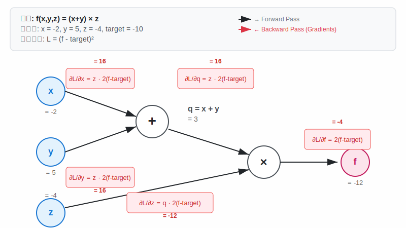
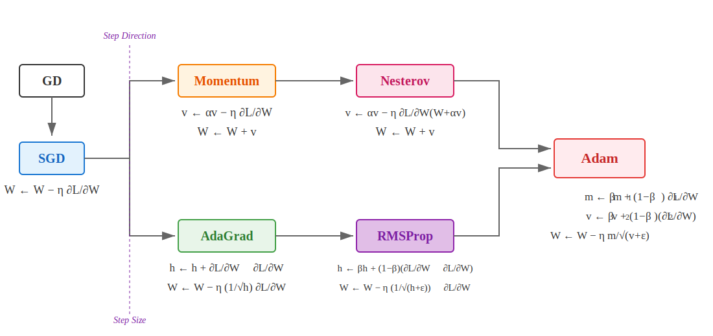

# 딥러닝
## 1. 기본개념
### 1.1. 딥러닝 발전 5단계
#### 1. Rule based programming
모든 연산 방법을 사람이 전부 고안
#### 2. 전통 머신러닝
SW1.5방식, 특징값을 뽑는 방식은 사람이, 특징값들로 판별하는 로직은 기계가 스스로 고안
#### 3. 딥러닝
SW2.0방식, 모든 연산을 기계가 고안 (이미지면 픽셀, 텍스트면 토큰화)
#### 4. Pre-training & Fine-tuning
기존의 문제점인 분류대상/태스크가 바뀔 때마다 다른 모델 필요

##### 4.1. 이미지의 경우:
- step1: Pretraining: 많은 동물을 구별하는 일반적 특징을 익히게
- step2: Fine-tuning: 태스크를 수행하기 위해 매핑 쪽에 해당하는 연산들만 새로 학습(판다, 토끼)

##### 4.2. 텍스트 데이터 관점: GPT1
- step1: Pretraining: 사람의 개입없이 즉, 라벨링 없이 입력 텍스트에서 정답을 만들어낸다! (Un-supervised or Self-supervised pre-training)
- 예) task: 다음 단어 맞추기 => 학습 데이터 만들기: 데이터 쌍 만들기(1.곰세마리가, 한) (2.곰 세마리가 한, 집에) (3.곰세마리가 한 집에, 있어) 
- step2: Fine-tuning/ Transfer Learning: 예) task 텍스트 분류 긍정적?부정적? => 사람이 라벨링한 features들을 모아서 학습. frozen features

#### 5. In-context learning (GPT3):
- 태스크 별 별도 모델이나 맞는 데이터 모을 필요없음. Pretraining된 모델로 여러 태스크 대응가능
- fine-tuning없이 태스크 설명 포함해서 text를 입력하면 output 출력함, pretraining된 모델만으로 fine-tuning만큼의 성능 얻음
- zero-shot: 태스크만 설명만, one-shot: 예제 하나, few-shot: 예제 여러개 추가


### 1.2. 딥러닝 기술 종류
- AI 구분법: 데이터: 정형데이터, 이미지/동영상, 텍스트, 음성, 학습: 교사, 비교사, 강화, 태스크: 인식, 생성
- AI: 프로그램은 특정 입력을 특정 출력이 나오도록 하는 연산의 집합, 모델
#### 1. 학습 방식에 의한 구분

##### 1.1. Supervised Learning: 라벨링 데이터, 직접 피드백 (classification, regression)
특정 입력에 대한 정답을 알려주는 방식으로 학습
- 객체검출: 분류 + 회귀 (예: 음식들 이미지 입력 -> 이미지 내 음식들 종류와 위치 출력
- 라벨링 노이즈: 라벨링 결과에 대한 노이즈, 즉 라벨링 작업에 대해 일관되지 않음의 정도, 교사 학습의 성능을 좌우
- 양질의 데이터 + balanced data면 좋은 모델 확보 가능

##### 1.2. Unsupervised Learning: 라벨링/피드백 없음, 숨은 구조 찾기
- 차원 축소, 클러스터링 태스크 수행
- 예) 클러스터링: 1)임의의 두점 정하고 클래스 부여->2)나머지 점들은 가장 가까운 쪽 클래스 중심점의 클래스 부여 -> 3)클래스별 중심점 재 계산 후 2)번 과정 반복
- 예) 차원 축소: N차원 입력을 n차원 출력으로 변경 
- Autoencoder : 차원축소 -> n차원 벡터 -> 차원확대
- 1) 정보압축: 이미지/비디오/오디오
- 2) 정보시각화: 사람이 눈으로 확인가능한 것은 3차원까지
- 3) 정보 특징: 중요특징 추출하여 분석에 사용

##### 1.3. Reinforcement Learning: 라벨링 데이터없음, 지연 피드백, 보상신호(정답 유사)
- 주어진 환경에서 더 높은 보상을 위해 최적의 행동을 취하는 정책을 학습
- 구성요소 4가지: Agent, Reward, Action, Environment
- 예) 자전거 배우기: Agent 어린아이, Action 핸들/페달/브레이크, Environment 학교 운동장, Reward 자전거 넘어지지않고 이동하는 시간, State 시각/청각/촉각
- 예) 아타리 비디오게임: Agent 게이머, Action UP/DOWN, Environment 게임시스템, Reward 게임 점수, State 게임화면
- 두가지 AI 필요: 정책/ 가치 함수 - 정책: 상태 -> 정책 -> 행동, 가치: 상태/행동 -> 가치함수 -> 보상

#### 2. 데이터형식에 의한 구분
- 정형데이터 (표-전통ML기법), 비정형 데이터 (이미지/동영상-CV, 텍스트-NLP, 음성-음성인식/생성)

##### 2.1. CV
- 이미지 -> AI -> 출력 : 얼굴 인식(분류), 얼굴 위치 검출(회귀), 성별 인식(분류), 나이 인식(회귀), 이미지 복원

##### 2.2. NLP
- 텍스트 -> AI -> 출력: 문장 작성(생성), 혐오글 분류(분류), 번역(생성), 감정 분류(분류)
- LLM (SW 3.0)은 하나의 모델로 다 대응 가능 (각 NLP 태스크별로 NLP AI 만들필요 없음)

##### 2.3. Speech recognition/Generation: 
- 음성 -> AI -> 출력: 음성 인식(글자 인식), 감정 분류(분류), 나이 인식(회귀), 화자 분류(분류), 
- 텍스트 -> AI -> 음성: 음성 생성(생성)

#### 3. 태스크 종류에 의한 구분
- 인식: 비정형 데이터를 입력 + 정보가 출력, 생성: 출력이 비정형 데이터
- 이미지 생성: prompt engineering - 원하는 이미지가 나오게 하기 위해서 꽤 상세하게 묘사필요
- 텍스트 생성: 23년 ChatGPT 등장 

## 2. 딥러닝 개요
- AI: 감지, 추론, 행동, 적응 가능한 프로그램, ML: 데이터 기반 개발, DL: 모델 구조가 뉴럴넷 기반
성능 = 모델 + 데이터 + 학습방법
### 2.1. 구성 요소
#### 1. 데이터
- 모델 학습을 위해 필요, MNIST, Fashion MNIST
#### 2. 모델
- 주어진 데이터를 원하는 결과로 변환, 일련의 연산 과정을 구조화. 딥러닝의 학습대상, MLP, CNN, RNN
#### 3. 손실함수
- 모델 결과에 대한 오차를 수치화, MAE, MSE, CE
#### 4. 최적화 알고리즘
- 손실 함수 값이 최소가 되도록 모델의 파라미터를 조정
- 시스템: y=ax+b, 파라미터: a,b
- 경사하강법, 확률적 경사하강법, 모멘텀
- 기타 알고리즘: Dropout, Regularization, Normalization 
#### 5. 딥러닝 파이프라인
- 모델이 데이터를 통해 추정한 값이 정답/목표(y)와 최대한 가까워지게 (손실함수 값이 최소화) 파라미터를 최적화 알고리즘을 적용하여 최적의 모델 파라미터를 찾는 과정

### 2.2. 모델학습법

#### 1. 퍼셉트론 (Perceptron)
- 일정 threshold를 넘어서면 1 출력, 아니면 0 출력
- 가중치, 임계치를 변화시키며 다양한 의사결정 모델을 만들 수 있음, bias, weights
- output = 1 if (w*x)+b > T  
- 퍼셉트론을 일반화하면 선형식을 통한 분리로 이해가능
- NAND(Not-AND) gate: 입력이 모두 1(High)일 때만 출력 0(Low)이 되고, 그 외에는 1을 출력하는 논리 게이트
#### 2. 다층 퍼셉트론 (Multi-Layer Perceptron)
- Fully-Connected Layers(FCs)의 동의어
- 특정 뉴런은 이전 레이어의 모든 뉴런들과 연결되어 있음
##### 2.1. 활성화함수
- 활성화함수가 없으면, 결국 다층이 아닌 단순한 선형식의 한층의 퍼셉트론과 동일해짐
- Sigmoid, Leaky ReLU, tanh, ReLU, ELU, Maxout, Step
- 시그모이드 함수: 0~1 사이 실수값, 연산 과정을 미분 가능하게 만들면 역전파 기법과 연관됨
#### 2.2. MLP 구조
- 노드, 뉴런: transition (z) + 활성화 함수
- 레이어/층(입력층, 은닉층, 출력층): MLP에서 레이어 수는 보통 은닉층 수 + 1개 의미
- 엣지, 커넥션: 가중치 의미

#### 3. 경사하강법 (Gradient Descent)
##### 3.1. 미분과 기울기
- 미분: 변수의 움직임에 따른 함수값의 변화를 측정하는 도구, 극한을 통해 정의됨
- 2차원 평면에서 함수의 기울기를 알면 어느 방향으로 점을 움직여야 함수값이 증가 or 감소하는지 알 수 있음, 미분값의 반대방향으로 가면 감소
- 편미분: 

##### 3.2. 경사하강법 (GD)
- 기울기가 감소하는 방향으로 x를 움직여서 f(x)의 최소값을 찾는 알고리즘
- 손실함수의 그래디언트가 감소하는 방향으로 파라미터를 움직여 손실함수의 최소값을 찾음
- 그래디언트: 벡터에 대한 미분
- 편미분: 벡터를 입력값으로 받는 다변수 함수의 경우, 각 변수에 대해 미분한 편미분을 사용
- 학습과정: 모델 파라미터 초기화 -> 2) 손실함수값을 구하고 미분으로 이를 최소화하는 모델 파라미터 W, b를 찾음 -> 3) 반복해서 2) 수행 이후 종료조건이 충족되면 학습 끝
- 한계: local minimum, global minimum 존재 (local minimum에서 학습 stop)
- 해결방안: 파라미터 초기화 잘하기, 모델 구조를 바꿔 그래프 모양을 바꾸기, Learning Step을 바꾸기
- 단점: 모든 샘플에 대해 loss를 구해 다 더해야.. 샘플 수 많으면 연산량 문제 생김 -> SGD: 전체아닌 일부 샘플에 대한 평균값으로 대체

```
# 경사하강법의 알고리즘
# gradient: 그래디언트 벡터 계산 함수, init: 시작점, lr: 학습률, eps: 알고리즘 종료조건
var = init
grad = gradient(var)
while norm(grad) > eps 
	var = var - lr * grad
	grad = gradient(var)
```

##### 3.3. 확률적 경사하강법 (SGD)
- 계산효율을 위해 손실값을 샘플별 합이 아닌 평균값으로
- 모든 데이터를 사용해 구한 경사를 통해 파라미터를 한번 업뎃하는 대신, 데이터 한개/일부 활용하여 구한 경사로 여러번 업뎃 진행
- 미분이 용이한 시그모이드 함수 사용
- 미니배치/배치: SGD를 통해 한번의 학습을 하는데에 사용되는 데이터샘플의 집합

#### 4. 역전파 (Backpropagation) 기초
- MLP와 같은 모델에 GD를 적용하는 과정을 이해하려면 역전파에 대한 이해 필수

##### 4.1. 등장
- SGD로 손실함수값의 미분 계산은 샘플 수를 줄여서 간단해졌지만, 모든 파라미터를 갱신해야하므로 모든 파라미터에 대한 미분 계산 필요
- 모든 w와 b에 대한 L의 편미분 계산 필요

##### 4.2. 계산그래프
- 일련의 연산과정을 하나의 방향 그래프로 나타낸것
- 편미분 계산이 가능하며 중간 결과들을 보관하는 것이 가능해짐
- 전체 편미분에 필요한 연산들을 작은 단위로 쪼개고, 각각 편미분을 적용해서 합쳐서 최종결과 도출

##### 4.3. 연쇄법칙
- 모든 파라미터에 대한 편미분을 구할때 사용
$\frac{df(g(x))}{dx} = \frac{df(g(x))}{dg(x)} \cdot \frac{dg(x)}{dx}$

##### 4.4. 역전파의 이해
- 신경망의 추론방향과 반대되는 방향으로, 순차적으로 오차에 대한 편미분을 수행하여 각 레이어의 파라미터를 업뎃하는 과정
- 덧셈노드: 편미분값이 그대로 넘어감
- 곱셈노드: 다른 엣지의 값이 곱해져서 넘어감



#### 5. 역전파 (Backpropagation) 심화
##### 5.1. 손실함수의 기본가정
- z: 활성화함수 입력, a: 활성화함수 출력
- 가정1: 학습 데이터 샘플에 대한 신경망의 총 손실은 각 데이터 샘플에 대한 손실의 합과 같다
- 가정2: 각 학습 데이터 샘플에 대한 손실은 최종 출력에 대한 함수이다
##### 5.2. 역전파 기본방정식
1) Error at the output layer
$$\delta^L = \nabla_a C \odot \sigma'(z^L)$$
2) Error relationship between two adjacent layers
$$\delta^l = \sigma'(z^l) \odot \left( (w^{l+1})^T \delta^{l+1} \right)$$
3) Gradient of C in terms of bias
$$\nabla_{b^l} C = \delta^l$$
4) Gradient of C in terms of weight
$$\nabla_{w^l} C = \delta^l (a^{l-1})^T$$

##### 5.3. 역전파 알고리즘
1) Input
$x$: Set the corresponding activation $a^1$ for the input layer.

2) Feedforward: For each $l = 2, 3, \ldots, L$ compute $z^l = w^l a^{l-1} + b^l$ and $a^l = \sigma(z^l)$.

3) Output error
$\delta^L$: Compute the vector $\delta^L = \nabla_a C \odot \sigma'(z^L)$.

4) Backpropagate the error: For each $l = L-1, L-2, \ldots, 2$ compute $\delta^l = ((w^{l+1})^T \delta^{l+1}) \odot \sigma'(z^l)$.

5) Output: The gradient of the cost function is given by $\frac{\partial C}{\partial w^l_{jk}} = a^{l-1}_k \delta^l_j$ and $\frac{\partial C}{\partial b^l_j} = \delta^l_j$.

#### 5.4. 모델 파라미터 업뎃 with GD
1) Input a set of training examples
2) For each training example
$x$: Set the corresponding input activation $a^{x,1}$, and perform the following steps:

- Feedforward: For each $l = 2, 3, \ldots, L$ compute $z^{x,l} = w^l a^{x,l-1} + b^l$ and $a^{x,l} = \sigma(z^{x,l})$.
- Output error: 
  $\delta^{x,L}$: Compute the vector $\delta^{x,L} = \nabla_a C_x \odot \sigma'(z^{x,L})$.
- Backpropagate the error: For each $l = L-1, L-2, \ldots, 2$ compute $\delta^{x,l} = ((w^{l+1})^T \delta^{x,l+1}) \odot \sigma'(z^{x,l})$.
3) Gradient descent: For each $l = L, L-1, \ldots, 2$ update the weights according to the rule.
$$w^l \rightarrow w^l - \frac{\eta}{m} \sum_x \delta^{x,l} (a^{x,l-1})^T$$
and the biases according to the rule. 
$$b^l \rightarrow b^l - \frac{\eta}{m} \sum_x \delta^{x,l}$$

#### 6. 손실함수
##### 6.1. 대표적 함수
- **MSE**: L2 Loss, 초반 학습이 빠르지만 이상치에 민감
- MAE: L1 Loss, 손실함수의 값이 최소값에 가까워져도 미분값이 동일하기에 점핑이 일어날 수 있으며 손실 함수의 크기를 직접 줄여야한다
- Huber Loss: 오차 일정수준 이하일 때 MSE, 그렇지않으면 MAE 사용, 두 함수의 장점 결합
- **CE (Cross Entropy)**: 주어진 확률변수 또는 사건집합에 대한 두 확률 분포 간의 차이를 측정하는 함수
- BCE: 이진 분류 문제에 사용되는 CE. (=Log Loss)
- Hinge Loss: 모델이 만드는 결정 경계와 데이터 사이 마진을 최대화하려는 손실함수 (=SVM Loss), 이진 분류 문제에 사용.
##### 6.2. 해석
- Backpropagation관점: 레이어 수가 증가할 수록 활성화함수의 미분값이 0에 수렴하는 문제 발생 (Vanishing Gradient Problem). 이런 관점에서, 미분값이 0, 1로만 표현되는 ReLU 선택 가능.
- Maximum Likelihood관점: 모델의 출력이 정해진 확률분포(가우시안)에서 나올 확률. -log를 붙여 손실함수값을 최소화하도록. (가정1: 모든 데이터는 서로 독립, 가정2: 모든 데이터는 동일한 확률분포 가짐) 
- 보통 회귀는 MSE, 분류는 CE 사용

### 2.3. 성능 고도화 방법 
#### 1. 과적합, 편향과 분산
- 과적합: 일반적으로, 학습 데이터는 부족하고 모델 파라미터가 많은 상황에서 발생. 
- Robust(강건): 과소적합, 과적합 아닌 상태
- 모델의 복잡성 증가하면 분산은 증가 , 편향은 감소
- 지역 최소값 (Local minimum): 
- 전역 최소값 (Global minimum): 최적의 학습 상태에 도달

#### 2. 네트워크 안정화 기법
##### 2.1. 드롭아웃
- 앙상블 방법 중 하나. 모델 학습시 임의의 가중치 노드를 일정확률로 비활성화시킴. (일반화가 잘된 모델이라면 일부 노드가 없어도 성능 떨어지지 않을것)
##### 2.2. 정규화
- 피쳐 스케일링: 서로 다른 입력 데이터 값을 일정한 범위로 맞추는 작업. 딥러닝에서는 일반적으로 0~1 사이 정규화함. 
- 4가지 방법: 배치, 레이어, 인스턴스, 그룹
- **배치 정규화**: 활성화 레이어 이후 출력을 정규화. 내부 데이터 분포변화 때문. 데이터가 레이어를 통과해도 배치 정규화로 인해 분포가 일정해짐. 배치 단위로 학습시 발생할 수 있는 분포를 정규화하여 모델 학습을 안정화함.
- 레이어 정규화: 개별 데이터 샘플 내의 모든 특징들의 평균, 분산 계산. 시계열 데이터와 같은 가변적 입력에서 적용이 힘든 배치 정규화의 단점을 보완.
- 인스턴스 정규화: 이미지 스타일 변환 같은 분야에서 각 데이터의 고유한 정보를 유지하기 위해 사용. 
- 그룹 정규화: 배치 사이즈를 극복하기 위한 방법. 배치 사이즈가 작아도 채널쪽 데이터를 활용하여 정규화

#### 3. 가중치 초기화
- 학습시에만 1회성 (차이점: 배치정규화는 학습시 지속적으로, 추론시에도 사용함)
- 필요 이유: 모델 층이 깊어질수록 활성화 함수 이후 데이터 분포가 한쪽 쏠림. Plateau같은 지점에서 초기화되면 모델 학습 비효율적. 손실함수로부터의 기울기값이 점점 작아지거나 커지면서 학습 비효율 발생. 
- 가중치의 분포가 적당히 넓게 고루 분포되게끔.
- Xavier: 시그모이드 활성화함수에서 효과. 이전 레이어 노드 수에 비례하여 가중치 초기화.
- He: ReLU 활성화함수에서 효과. Xavier보다 더 큰 스케일 사용 -> 기울기 소실 문제 완화  

#### 4. 규제화 및 학습률 조정
##### 4.1. 가중치 감쇠
- 큰 가중치에 대한 패널티를 부과하여 모델의 가중치를 작게 유지하려함. 훈련 데이터가 적거나, 훈련 데이터에 노이즈 많은 경우에 유용함. L1규제화: 절대값, L2규제화: 제곱
##### 4.2. 학습 조기 종료, 학습 스케줄러
- 조기종료: 모델 학습시 과적합을 방지
- 학습 스케줄러(Learning rate scheduler): 학습률을 동적으로 조절 (보통 Step Decay, Exponential Decay 많이 씀)

#### 5. 다양한 최적화 방법

##### 5.1. 기본적인 옵티마이저 
- 최적화 목표: 손실함수 값을 최소화하는 가중치를 효율적으로 찾는 것
- GD, SGD
##### 5.2. 스텝 방향을 개선한 옵티마이저
- Momentum: SGD에 관성효과 추가. 예) 원래방향 * 0.9 + 현재파라미터변화량 * 0.1
- Nesterov (NAG): 다음 위치에서의 기울기를 미리 계산
##### 5.3. 스텝 사이즈를 개선한 옵티마이저
- AdaGrad: 학습률을 자동조정하며 가중치 갱신
- RMSProp: 최근 기울기 위주로 업뎃. EMA방식(지수이동평균) 사용
##### 5.4. 스텝 방향과 사이즈 모두 개선한 옵티마이저
- Adam: Momentum + RMSProp의 장점 결합. 기울기의 1차 모멘트(평균)과 2차 모멘트(분산)을 추정하여 학습률 조정
- 보통 Adam성능 좋으므로 초기에는 Adam씀


#### 6. 데이터 증강, 전이학습, 자기지도학습

##### 6.1. 데이터증강
- 충분한 양의 학습 데이터 확보 중요
- Resize, Rotation, Flipping, Crop -> OpenCV 라이브러리 활용
- Albumentations (색상변화), ImgAug(라벨링까지 수정가능)
- 주의점: 해당 데이터의 도메인을 잘 고려해야함. 문맥/의미 왜곡X
- Cutout(특정값 가림), Mixup(두 이미지 픽셀값 조합), CutMix(하나의 이미지에서 잘라낸 영역을 다른 이미지에 붙여넣음)
- 텍스트 증강: 동의어 대체, 무작위 삽입, 무작위 교체, 무작위 삭제, 의미 유지 변환, 역번역, 사전학습된 언어모델 활용(BERT, GPT2, BART), Temperature, Top-k, Top-p 파라미터 사용해서 텍스트 생성 제어
##### 6.2. 전이학습
- 의료 이미지 분석 분야에서 소량의 데이터로 활용, 감정분석
- 이미 다른 문제에 대해 학습된 모델 지식을 새로운 작업에 활용하는 방법 
##### 6.3. 자기지도학습
- 레이블이 명시적으로 제공되지 않아도 모델이 스스로 학습할 수 있게 하는 방식
- 생성학습: 입력데이터가 그대로 출력데이터 (오토인코더 구조) 
- 대체작업학습: 각각 이미지를 여러 방식으로 변형하여 원본 이미지를 식별할 수 있는 특징 학습하도록 함
- 대조학습: 서로 다른 이미지를 얼마나 비슷/다른지 비교하는 것을 목표

### 2.4. 기본 모델 구조들
#### 1. CNN
##### 1.1. 합성곱 신경망
- 완전 연결 신경망의 한계점: 1차원으로 평탄화하는 과정에서 이미지 데이터가 갖고 있던 형상정보 왜곡
- 이미지 입력 후 합성곱 연산으로 모델 구조를 정해서 형상정보를 유지하려함
##### 1.2. 구성요소
- 합성곱 연산: 이미지 내 엣지 찾는 방식으로 많이 사용됨
- 스트라이드: 입력 데이터에 필터를 적용할때 필터가 이동하는 간격. 피처맵 크기를 조정할때 사용. 스트라이드 값이 클수록 피처맵 크기가 작아짐
- 패딩: 합성곱 연산 수행 전에 입력 데이터 주변을 특정값 (주로 0)으로 채우는 연산. 합성곱 연산을 반복하면 피처맵 크기가 점점 줄어 학습 비효율
- 필터는 R,G,B채널의 3개, 출력의 채널은 1개. (필터 = Kernel)
- 예: CV의 Convolution Layer: 비전 task를 수행하는 데에 유용한 Feature들을 학습할 수 있도록 함. Input image를 특정 크기 필터를 이용해 탐색하며 Convolution 연산을 시행하여 필터 영역에 대한 특징 추출) 
- 필터의 가중치 데이터는 4차원 데이터 (출력 채널수, 입력 채널수, 높이, 너비)
- 활성화 함수: 모델이 비선형성 가지게 하여 복잡한 문제 해결 가능 (Sigmoid, ReLU, tanh, Maxout, Leaky ReLU, ELU)
- 풀링(Pooling) 연산: 합성곱 레이어의 출력을 다운샘플링하여 특징 맵의 크기를 줄이는 역할 -> 파라미터 수 줄이고 과적합 방지, 계산효율성 높임. 잡음에 대한 강인성 확보. Feature Map이 줄어들어 receptive field가 달라지게 됨
- 최대 풀링: 주어진 윈도우 내 가장 큰값 선택. 도출된 특징이 가장 두드러지게 표현됨
- 평균 풀링: 주어진 윈도우 내 모든값의 평균 계산. 피처맵의 일반정보 보존 

#### 2. RNN
##### 2.1. 순환신경망
- 기존 CNN은 주로 고정된 크기의 입력을 요구하는 이미지 분류에서 훌륭.
- 크기가 고정되지 않는 데이터를 다룰 때. 과거정보 기억 + 가변적인 현재입력도 동시 처리
- 시퀀스를 입력/출력 모두 가능 (one to many, many to one)
##### 2.2. 구성요소
- 시계열, 순차적 데이터 처리에 특화된 신경망 구조. 각 시간 단계에서의 출력이 이전 단계의 정보 포함
- 시퀀스가 길어질수록 앞부분 정보를 잊어버리는 문제 발생. 출력과 가까운 쪽은 가중치 업뎃이 잘됨 -> 장기 의존성 문제 해결을 위해 LSTM, GRU 등장
- LSTM: Forget gate(기존 정보중 어떤 정보를 버릴지 선택), Output gate(다음 상태로 어떤 정보를 내보낼지), Input Gate(입력 데이터 중 어떤 정보를 다음으로 저장할지)
- GRU(Gated Recurrent Unit): Reset gate, Update gate(LSTM의 output+input 합친느낌) 두개. 적은 파라미터로 유사한 성능

#### 3. 딥러닝 역사
##### 3.1. 발전
- AlexNet: 2012년 등장 이후 딥러닝 전성기
- GAN(2014): 이미지 생성의 출발점 모델
- ResNet(2015): 네트워크 깊이를 크게 확장하면서 효율 학습 가능하게. Residual connection 도입
- transformer(2017): self-attention 매커니즘 사용
##### 3.2. 최신 동향
- BERT(2018): 언어이해를 위한 훈련된 양방향 transformer 구조 사용(pretraining, finetuning)
- GPT(2018): generative pre-trained transformer
- ChatGPT(2022): OpenAI에서 개발한 GPT아키텍처 기반 챗봇 전용 모델
- LLMs: OpenLLM, 허깅페이스의 리더보드 참고  
- **Paperswithcode** 참고사이트: 최신 모델/데이터셋 관련 소식 뉴스레터

