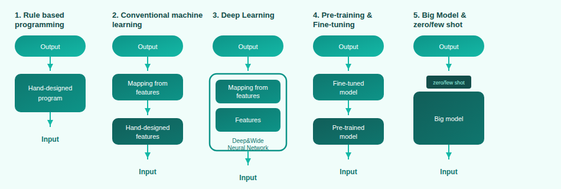

# 딥러닝
## 1. 기본개념
### 1.1. 딥러닝 발전 5단계
#### 1. Rule based programming
모든 연산 방법을 사람이 전부 고안
#### 2. 전통 머신러닝
SW1.5방식, 특징값을 뽑는 방식은 사람이, 특징값들로 판별하는 로직은 기계가 스스로 고안
#### 3. 딥러닝
SW2.0방식, 모든 연산을 기계가 고안 (이미지면 픽셀, 텍스트면 토큰화)
#### 4. Pre-training & Fine-tuning
기존의 문제점인 분류대상/태스크가 바뀔 때마다 다른 모델 필요

##### 4.1. 이미지의 경우:
- step1: Pretraining: 많은 동물을 구별하는 일반적 특징을 익히게
- step2: Fine-tuning: 태스크를 수행하기 위해 매핑 쪽에 해당하는 연산들만 새로 학습(판다, 토끼)

##### 4.2. 텍스트 데이터 관점: GPT1
- step1: Pretraining: 사람의 개입없이 즉, 라벨링 없이 입력 텍스트에서 정답을 만들어낸다! (Un-supervised or Self-supervised pre-training)
- 예) task: 다음 단어 맞추기 => 학습 데이터 만들기: 데이터 쌍 만들기(1.곰세마리가, 한) (2.곰 세마리가 한, 집에) (3.곰세마리가 한 집에, 있어) 
- step2: Fine-tuning/ Transfer Learning: 예) task 텍스트 분류 긍정적?부정적? => 사람이 라벨링한 features들을 모아서 학습. frozen features

#### 5. In-context learning (GPT3):
- 태스크 별 별도 모델이나 맞는 데이터 모을 필요없음. Pretraining된 모델로 여러 태스크 대응가능
- fine-tuning없이 태스크 설명 포함해서 text를 입력하면 output 출력함, pretraining된 모델만으로 fine-tuning만큼의 성능 얻음
- zero-shot: 태스크만 설명만, one-shot: 예제 하나, few-shot: 예제 여러개 추가

### 1.2. 딥러닝 기술 종류
- AI 구분법: 데이터: 정형데이터, 이미지/동영상, 텍스트, 음성, 학습: 교사, 비교사, 강화, 태스크: 인식, 생성
- AI: 프로그램은 특정 입력을 특정 출력이 나오도록 하는 연산의 집합, 모델
#### 1. 학습 방식에 의한 구분

##### 1.1. Supervised Learning: 라벨링 데이터, 직접 피드백 (classification, regression)
특정 입력에 대한 정답을 알려주는 방식으로 학습
- 객체검출: 분류 + 회귀 (예: 음식들 이미지 입력 -> 이미지 내 음식들 종류와 위치 출력
- 라벨링 노이즈: 라벨링 결과에 대한 노이즈, 즉 라벨링 작업에 대해 일관되지 않음의 정도, 교사 학습의 성능을 좌우
- 양질의 데이터 + balanced data면 좋은 모델 확보 가능

##### 1.2. Unsupervised Learning: 라벨링/피드백 없음, 숨은 구조 찾기
- 차원 축소, 클러스터링 태스크 수행
- 예) 클러스터링: 1)임의의 두점 정하고 클래스 부여->2)나머지 점들은 가장 가까운 쪽 클래스 중심점의 클래스 부여 -> 3)클래스별 중심점 재 계산 후 2)번 과정 반복
- 예) 차원 축소: N차원 입력을 n차원 출력으로 변경 
- Autoencoder : 차원축소 -> n차원 벡터 -> 차원확대
- 1) 정보압축: 이미지/비디오/오디오
- 2) 정보시각화: 사람이 눈으로 확인가능한 것은 3차원까지
- 3) 정보 특징: 중요특징 추출하여 분석에 사용

##### 1.3. Reinforcement Learning: 라벨링 데이터없음, 지연 피드백, 보상신호(정답 유사)
- 주어진 환경에서 더 높은 보상을 위해 최적의 행동을 취하는 정책을 학습
- 구성요소 4가지: Agent, Reward, Action, Environment
- 예) 자전거 배우기: Agent 어린아이, Action 핸들/페달/브레이크, Environment 학교 운동장, Reward 자전거 넘어지지않고 이동하는 시간, State 시각/청각/촉각
- 예) 아타리 비디오게임: Agent 게이머, Action UP/DOWN, Environment 게임시스템, Reward 게임 점수, State 게임화면
- 두가지 AI 필요: 정책/ 가치 함수 - 정책: 상태 -> 정책 -> 행동, 가치: 상태/행동 -> 가치함수 -> 보상

#### 2. 데이터형식에 의한 구분
- 정형데이터 (표-전통ML기법), 비정형 데이터 (이미지/동영상-CV, 텍스트-NLP, 음성-음성인식/생성)

##### 2.1. CV
- 이미지 -> AI -> 출력 : 얼굴 인식(분류), 얼굴 위치 검출(회귀), 성별 인식(분류), 나이 인식(회귀), 이미지 복원

##### 2.2. NLP
- 텍스트 -> AI -> 출력: 문장 작성(생성), 혐오글 분류(분류), 번역(생성), 감정 분류(분류)
- LLM (SW 3.0)은 하나의 모델로 다 대응 가능 (각 NLP 태스크별로 NLP AI 만들필요 없음)

##### 2.3. Speech recognition/Generation: 
- 음성 -> AI -> 출력: 음성 인식(글자 인식), 감정 분류(분류), 나이 인식(회귀), 화자 분류(분류), 
- 텍스트 -> AI -> 음성: 음성 생성(생성)

#### 3. 태스크 종류에 의한 구분
- 인식: 비정형 데이터를 입력 + 정보가 출력, 생성: 출력이 비정형 데이터
- 이미지 생성: prompt engineering - 원하는 이미지가 나오게 하기 위해서 꽤 상세하게 묘사필요
- 텍스트 생성: 23년 ChatGPT 등장 

## 2. 딥러닝 개요
AI: 감지, 추론, 행동, 적응 가능한 프로그램, ML: 데이터 기반 개발, DL: 모델 구조가 뉴럴넷 기반
성능 = 모델 + 데이터 + 학습방법
### 2.1. 구성 요소
#### 1. 데이터
모델 학습을 위해 필요
MNIST, Fashion MNIST
#### 2. 모델
주어진 데이터를 원하는 결과로 변환, 일련의 연산 과정을 구조화. 딥러닝의 학습대상 
MLP, CNN, RNN
#### 3. 손실함수
모델 결과에 대한 오차를 수치화
MAE, MSE, CE
#### 4. 최적화 알고리즘
손실 함수 값이 최소가 되도록 모델의 파라미터를 조정
시스템: y=ax+b, 파라미터: a,b
경사하강법, 확률적 경사하강법, 모멘텀
기타 알고리즘: Dropout, Regularization, Normalization 
#### 5. 딥러닝 파이프라인
모델이 데이터를 통해 추정한 값이 정답/목표(y)와 최대한 가까워지게 (손실함수 값이 최소화) 파라미터를 최적화 알고리즘을 적용하여 최적의 모델 파라미터를 찾는 과정

 
